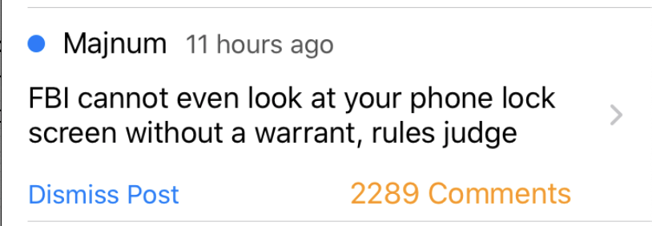
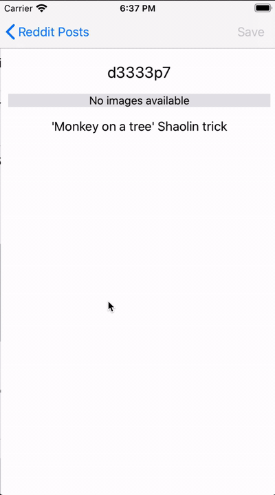

## iOS-Test

### Guidelines

- Assume the latest platform and use Swift: ✅
- Use UITableView / UICollectionView to arrange the data. ✅
- Please refrain from using any dependency manager [cocoapods / carthage / etc], instead, use URLSession ✅
- Support all Device Orientation ✅
- Support all Devices screen (iPhone/iPad) ✅
- Use Storyboards ✅

### What to show:

- Title (at its full length, so take this into account when sizing your cells) ✅
- Author ✅
- entry date, following a format like “x hours ago” ✅
- A thumbnail for those who have a picture. ✅
- Number of comments ✅
- Unread status ✅

| Small Title | Big Title | No Thumbnail |
|-------------|-----------|--------------|
||||

### Notes

- I followed the design of `iphonedetail.png` and `iphone.png`
- The architecture choosen for the App is MVVM. For binding I'm using a custom made `Observable` to avoid integrating a heavy library just for that. I thought about using combine but I have no experience and it was going to take me more time than the available.
- `UITableView` data source is a `UITableViewDiffableDataSource` and changes on the dataSource are made with `NSDiffableDataSourceSnapshot`. Super nice Api.
- Requests to server are made with: `URLSession`
- Using `Decodable` for `JSON` -> `Model`
- Added some tests but it could be tested even more. Tested models, ViewModels and Service. All the `ViewModels` and `Service` implement a protocol so it's easy to Mock/Stub them for testing.
- The state of the `hidden`/`read` is saved on `UserDefaults`. In a real world app I would have choosen something different. (`SQLite` with `SQLite.swift` or `CoreData`) but I think this is an overkill for the scenario.
- There were no mention to localization so I didn't localize the app which I would have done in real life.
- I didn't log much but I left `os_log` ready to be used.

### Sample app running on iPhone XS:

[Download sample video App!](sample-app.mp4)

### Functionality
	
| Feature | Gif |
|-------------|-----------|
| Pull to Refresh |  |
| Pagination support | |
| Saving pictures in the picture gallery | |
| Indicator of unread/read post | |
| Dismiss Post Button |  |
| Dismiss All Button | |
| App State-preservation/restore | |
| Tap on the thumbnail open full size| |
		

### Screenshots iPhone/iPad:

| Orientation | Picture |
|-------------|-----------|
| Portrait |  |
| Landscape |  |
| iPad Landscape |  |
| iPad Portrait |  |

